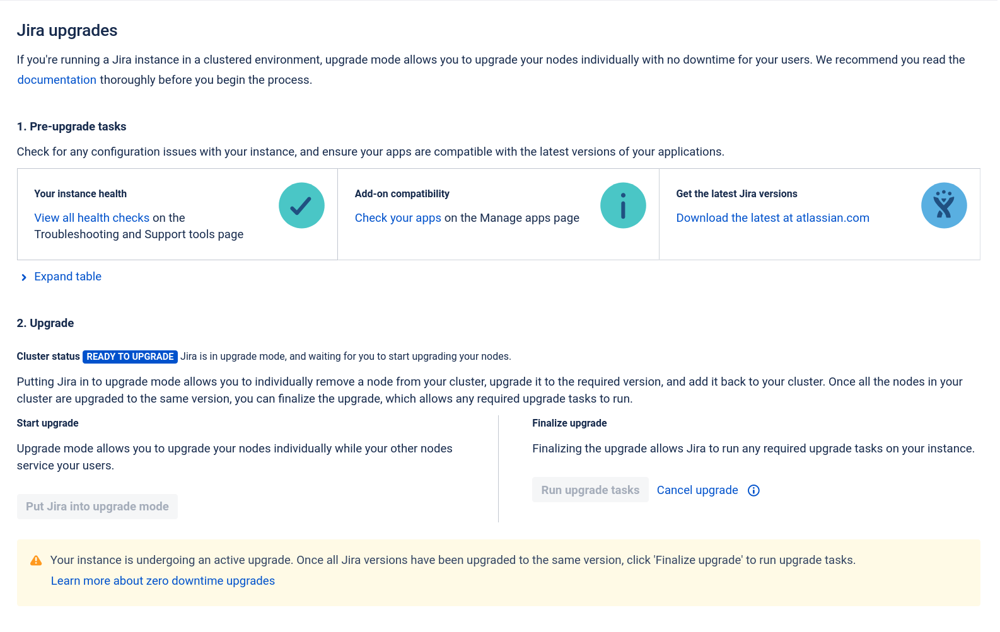

# Jira Rolling Upgrade
Let's say we have Jira version `8.13.0` deployed to our Kubernetes cluster, and we want to upgrade it to version
`8.13.1`, which we'll call the *target version*. You can substitute the target version for the one you need, as long as
it's newer than the current one.

## 1. Find tag of the target image

Go to [atlassian/jira-software](https://hub.docker.com/r/atlassian/jira-software/tags)
Docker Hub page to pick a tag that matches your target version.

In the example we're running Jira using the `8.13.0-jdk11` tag, and we'll be upgrading to `8.13.1-jdk11` - our *target*.

## 2. Put Jira into upgrade mode

Go to **Administration > Applications > Jira upgrades** and click **Put Jira into upgrade mode**.

  

## 3. Run the upgrade using Helm

Run Helm *upgrade* command with your release name (`<release-name>`) and the target image from a previous step
(`<target-tag>`). For more details, consult the [Helm documentation](https://helm.sh/docs/).

 ```shell script
 $ helm upgrade <release-name>  atlassian-data-center/jira --wait --reuse-values --set image.tag=<target-tag>
 ```

If you used `kubectl scale` after installing the Helm chart, you'll need to add `--set
replicaCount=<number-of-jira-nodes>` to the command. Otherwise, the deployment will be scaled back to the original
number which, most likely, is one node.

## 4. Wait for the upgrade to finish
The pods will be re-created with the updated version, one at a time.



## 5. Finalize the upgrade
After all pods are active with the new version, click **Run upgrade tasks** to finalize the upgrade:


***
* Go back to [README.md](../../README.md)
* Go back to the [operation guide](../OPERATION.md)
